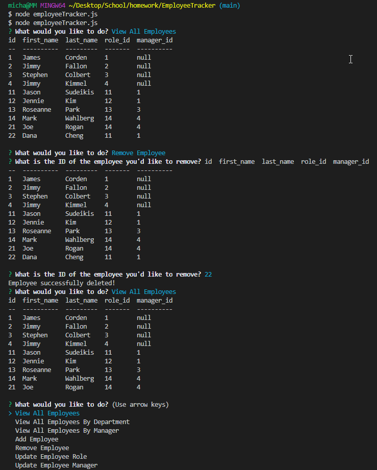
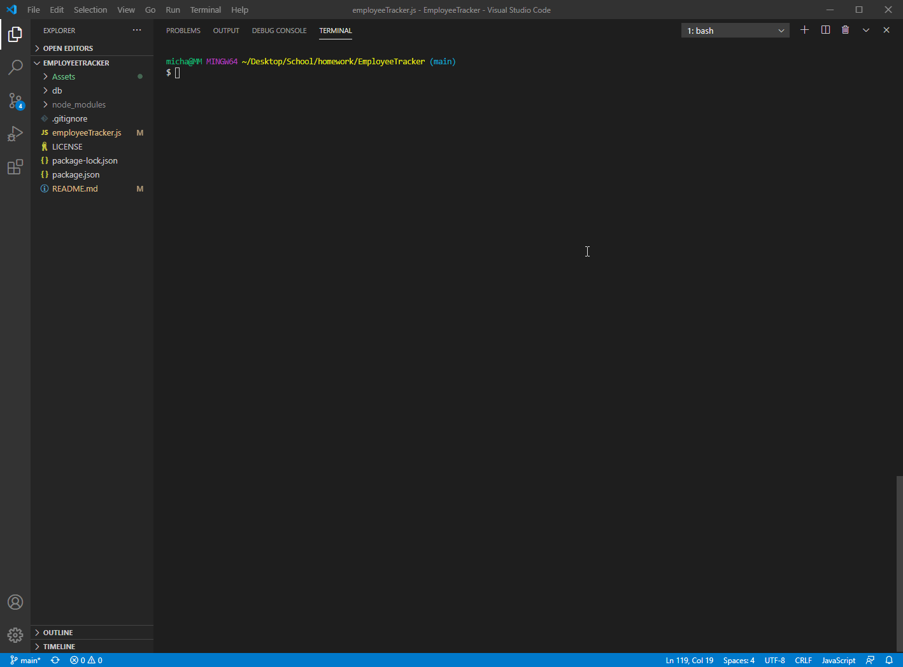

# EmployeeTracker

## Summary
A business owner wanted to be able to manage their departments, roles, as well as employees as they come and go so they can organize and plan business moving forward. This Employee Tracker is a command-line application that gives business owners to add, remove, and update employee information as they see fit.

<br>
<br>

## Example 






[Link to Demo Video]()
<br>
<br>


## Requirements To Run
This application functions through the use of the JSON packages mysql, console.table, and inquirer through Node.js. Prior to running this application, users must run the command "npm install" to install all package dependencies. Running in a local server, users must also execute the schema.sql before starting the application in terminal using "node employeeTracker.js"

<br>
<br>

## Code Snippet
```javascript
function viewAllEmployeesByDepartment() {
    connection.query("SELECT * FROM department", function (err, res) {
        if (err) throw err;
        console.table(res);
    });
    inquirer
        .prompt({
            type: "input",
            name: "department",
            message: "Enter department name to view all employees currently in the department!"
        })
        .then((answer) => {
            var query = "SELECT employee.id, employee.first_name, employee.last_name, role.title, department.name,  employee.manager_id FROM ((employee INNER JOIN role On employee.role_id = role.id) INNER JOIN department ON department.id = role.department_id) WHERE department.name = ?";
            connection.query(query, [answer.department],
                function (err, res) {
                    if (err) throw err;
                    console.table(res);
                    runSearch();
                })
        })
};
```
This code snippet is one example of the different cases ran from the initial function "runSearch()". When the prompt is chosen to view employees by department, a list of departments are printed to the console for users to reference. Using Inner Join feature from mysql, all three tables from the schema.sql are utilized to parse the information needed to print the employees of the user prompted department choice. 
<br>
<br>

## Built Using

* [Javascript](https://developer.mozilla.org/en-US/docs/Web/JavaScript)
* [Node.js](https://nodejs.org/en/)
* [MySQL](https://www.npmjs.com/package/mysql)
* [JSON](https://www.json.org/json-en.html)
* [console.table](https://www.npmjs.com/package/console.table)
* [InquirerJs](https://www.npmjs.com/package/inquirer/v/0.2.3)

<br>
<br>

## Author

**Michael Medina** 
- [Link to Github](https://github.com/michaelanthonyyy)
- [Link to LinkedIn](https://www.linkedin.com/in/michael-medina-22aa70200?lipi=urn%3Ali%3Apage%3Ad_flagship3_profile_view_base_contact_details%3B311BosSLTMS4JkhAfkX61A%3D%3D)
- [Link to Portfolio](https://michaelanthonyyy.github.io/portfolio2021/)

<br>
<br>

## LICENSES

Copyright (c) 2021 MIT LICENSE